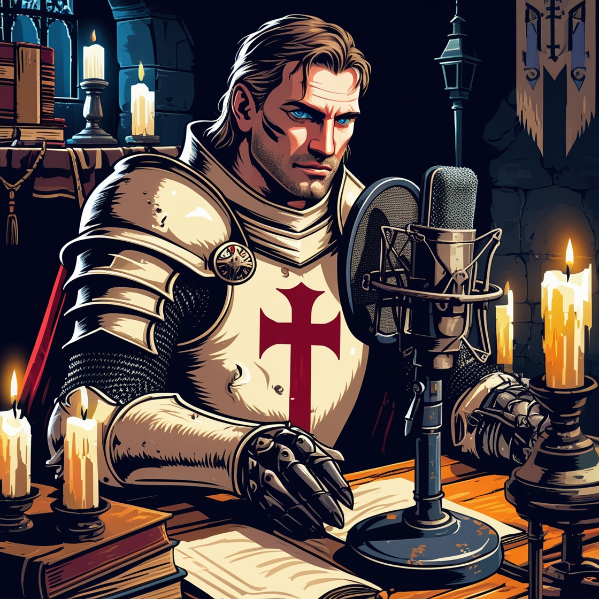

    Capa do Podcast

# Projeto Podcast Gerado por I.A.s

 > ℹ️ **NOTE:** Repositório desenvolvido para o Desafio de Projeto "Criando um Podcast com IAs Generativas", do Bootcamp CAIXA - IA Generativa com Microsoft Copilot da plataforma da [DIO](https://dio.me)

O objetivo desse Projeto é gerar um podcast utilizando ferramentas de IA empregando prompts avançados.
Foi utilizada uma esteira de prompts para gerar cada etapa do processo criativo.

## 💻 Tecnologias utilizadas no projeto

- [ChatGPT](https://chat.openai.com/) 
- [Leonardo.Ai](https://app.leonardo.ai/)
- [ElevenLabs](https://beta.elevenlabs.io/)
- [Capcut](https://www.capcut.com/pt-br/)

## ✨ Como foi feito ?

- Título e Roteiro gerados via Chat GPT
- Audio gerado pela Eleven Labs
- Imagem de capa gerada no Leonardo.Ai
- Capcut utilizado para tratar o aúdio e adicionar sons de fundo

## 📚 Resultados

- [Imagem da Capa](https://github.com/Webert1982/podcast-generated-by-ai/tree/main/output/Templar_knight_podcaster.jpg)
- [Áudio do Podcast](https://github.com/Webert1982/podcast-generated-by-ai/tree/main/output/podcast_editado.MP3)

## 🛠️ Execução

Utilizei os prompts salvos em `src/prompts` para criar um podcast de maneira automatizada, seguindo o passo a passo abaixo:

- 🤖 1. Usei os prompts em <a href="https://github.com/Webert1982/podcast-generated-by-ai/blob/main/src/prompts/chatgpt.md">Chat GPT</a> para gerar o título e o roteiro no `chagpt`
- 🤖 2. Usei o prompt de roteiro gerado pelo chatgpt em <a href="https://github.com/Webert1982/podcast-generated-by-ai/blob/main/src/prompts/elevenlabs.md">Eleven Labs</a> para gerar o áudio no `elevenlabs`
- 🤖 3. Usei o prompt em <a href="https://github.com/Webert1982/podcast-generated-by-ai/blob/main/src/prompts/leonardoai.md">Leonardo.Ai</a> para gerar a imagem de capa no `leonardo.ai`

## 👨‍💻 Criador

    
    
&nbsp&nbsp&nbspWebert Pimenta 
    &nbsp&nbsp&nbsp
    <a href="https://github.com/Webert1982">
    GitHub</a>&nbsp;|&nbsp;
    <a href="https://www.linkedin.com/in/webert-pimenta-4a82a5340/">LinkedIn</a>
&nbsp;|&nbsp;
    <a href="https://www.instagram.com/webertpimenta/">
    Instagram</a>
&nbsp;|&nbsp;

  

